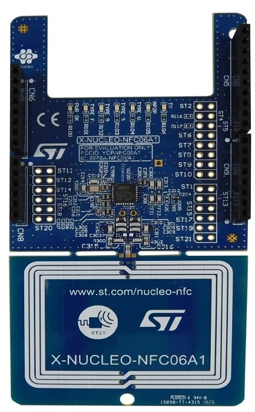

.. _x-nucleo-nfc06a1:

X-NUCLEO-NFC06A: NFC card reader expansion board based on ST25R3916 for STM32 and STM8 Nucleos 
##############################################################################################

Overview
********
The X-NUCLEO-NFC06A1 NFC card reader expansion board is based on the ST25R3916 device.
The expansion board is configured to support ISO14443A/B, ISO15693, FeliCaTM and AP2P communication.
The ST25R3916 manages frame coding and decoding in reader mode for standard applications, such as NFC, proximity and
vicinity HF RFID standards. It supports ISO/IEC 14443 Type A and B, ISO/IEC 15693 (single subcarrier only) and ISO/IEC
18092 communication protocols as well as the detection, reading and writing of NFC Forum Type 1, 2, 3, 4 and 5 tags.
The on-board low power capacitive sensor performs ultra-low power wake-up without switching the reader field on and
traditional inductive wake-up to select amplitude or phase measurement.
The automatic antenna tuning (AAT) technology enables operation close to metallic parts and/or in changing environments.

More information about the board can be found at the
`X-NUCLEO-NFC06A website`_.

Hardware
********

X-NUCLEO-NFC06A1 provides the following key features:

- On-board NFC card reader IC: ST25R3916
- 47 mm x 34 mm, four turns, 13.56 MHz inductive antenna etched on PCB and
- associated tuning circuit
- Six general purpose LEDs
- ISO 18092 passive and active initiator, ISO 18092 passive and active target 
- NFC-A and NFC-F card emulation
- ISO 14443A and ISO14443B
- ISO 15693
- FeliCaTM
- Up to 1.7 W output power with differential antenna
- Possibility of driving two antennas in single ended configuration
- Inductive and capacitive wake-up
- Automatic antenna tuning system
- Transparent and Stream modes to implement MIFARE(TM) Classic compliant or other custom protocols
- Equipped with Arduino UNO R3 connector
- Free comprehensive development firmware library compatible with STM32Cube and samples for ST25R3916
- Scalable solution for multiple board cascade
- FCC certified
- RoHS and WEEE compliant

More information about X-NUCLEO-NFC06A1 can be found here:
       - `X-NUCLEO-NFC06A1 user manual`_

Programming
***********

References
**********

.. target-notes::

.. _X-NUCLEO-NFC06A1 website:
   http:///www.st.com/en/ecosystems/x-nucleo-nfc06a1.html

.. _X-NUCLEO-NFC06A1 user manual:
   http://www.st.com/resource/en/user_manual/dm00634930.pdf
